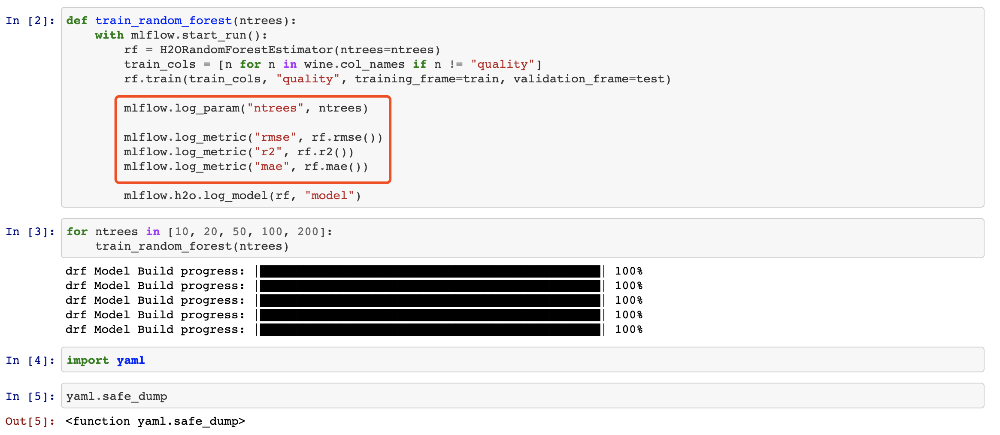
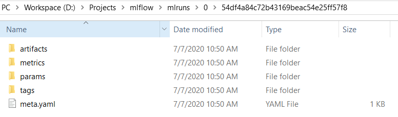
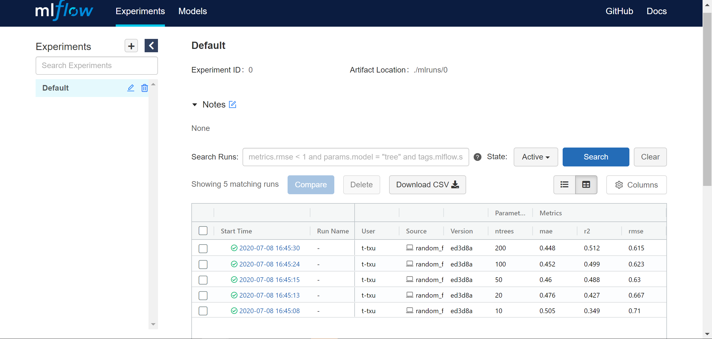
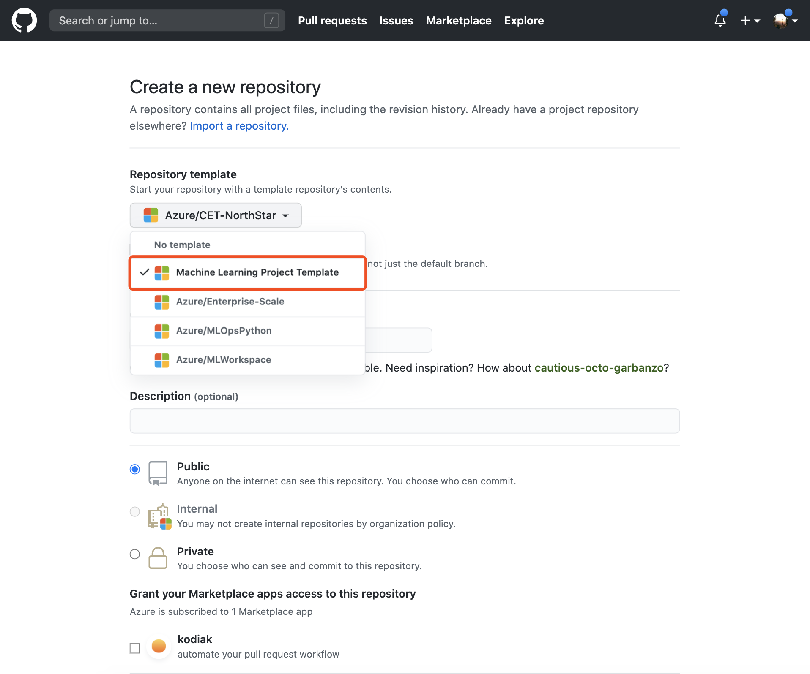
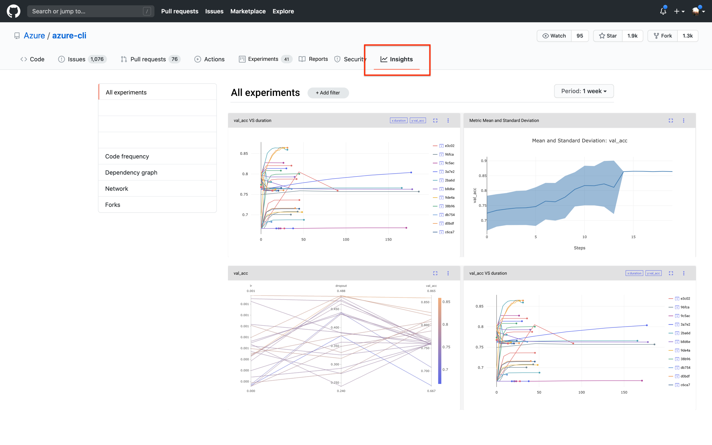
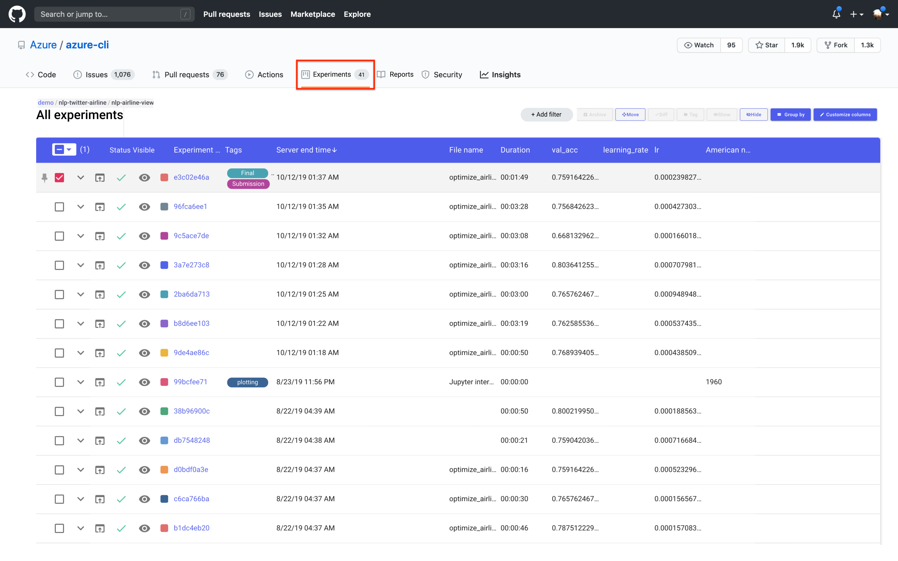
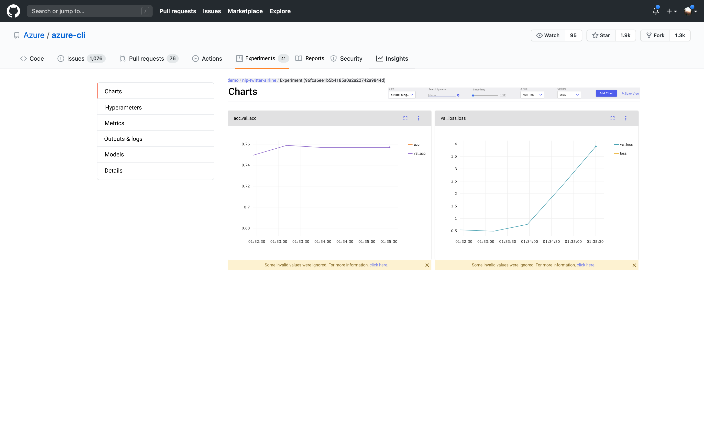
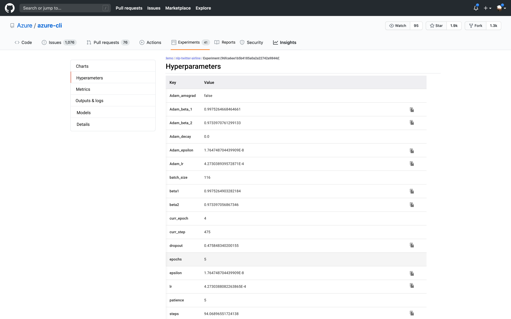
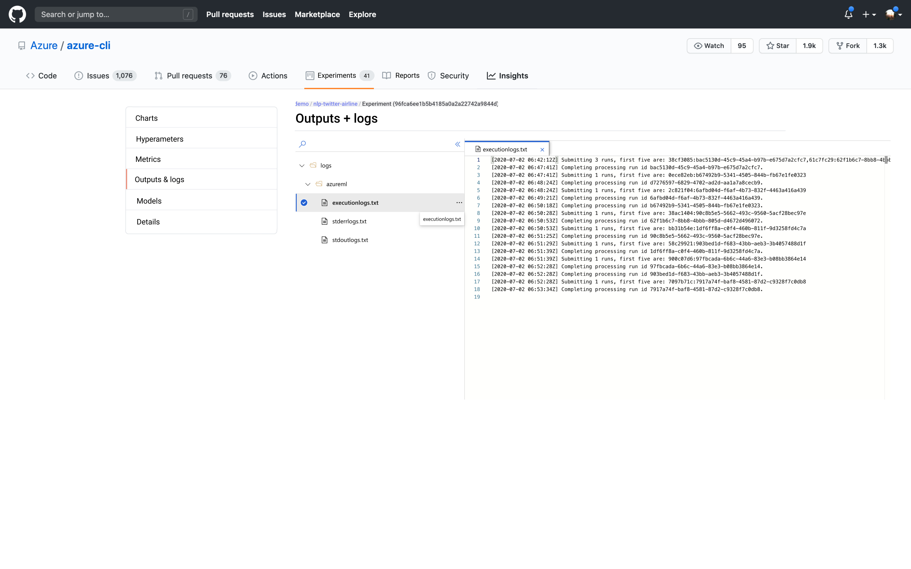

## Customer Profile
Sarah is a machine learning researcher at Contoso. She usually starts her day by reviewing new papers and findings shared within her company. Typically, she would go through the paper and find the attached GitHub repo to get to the relevant codes and Jupyter notebooks. However, despite the ability run code in Jupyter, she is often frustrated by the absence of parameters, convoluted environment setup experience, mismatch of libraries versions, which all prevent her from reproducing and investigating the results from the papers.
 
Aside from reading papers, Sarah spends the majority of her time training models and running experiments on her desktop. She has several Conda environments for various experiments that she runs; she uses MLflow to track parameters, logs, and metrics. However, she faces the same issue that bothers her - when she wants to share any progress with the team, she cannot easily commit machine learning environments, settings, histories, logs, metrics in similar fashion as with using Git controls. The setup would be prohibitively complicated that her colleagues would not be able to run on their machines too.
 
Additionally every once a while, Sarah would read new insights from papers and would like to go back to an experiment done several months ago. With Git, Sarah was able to jump back to the code she had then, but it is very unlikely to produce the same results, needless to say any further modification on parameters and environmental changes.
 
However, these issues could be elegantly resolved with Microsoft's renewed vision for ML experience where any ML professionals can run, track, share ML projects with a simple 'fork and compile' that would normally takes days to realize.


## The New ML Experience


#### Prerequisites
To follow along, please execute the following commands:
```bash 
git clone git@github.com:aronchick/octostore.git 
cd octostore
pipenv install
pipenv shell
```

#### Step by step tutorial (Wine quality prediction)
1. Sarah creates a new project folder on her Office desktop. She uses local __Jupyter notebook__ to write and run her training code. In this experiment, she wants to use _random forest_ tree to predict wine quality, and uses __mlflow__ to track the experiment. In her current folder, she has the following items:
   ```
   mlflow/examples/h2o
   \
      conda.yaml
      random_forest.ipynb
      random_forest.py
      wine-quality.csv
   ```


2. In her training code, she uses __MLflow logging API__ to log metrics and artifacts. 
   

   After finish writing the training code, she runs the entire python script by
   ```
   python random_forest.py
   ```
   > Note: you can also open ```random_forest.ipynb``` in Jupyter Notebook to execute one step at the time.


3. The metrics and artifacts are stored in the specific folders under the local project folder ```mlflow/examples/h2o/mlruns/```.

   


4. Sarah then wants to visualize and compare different runs' results on her local dashboard. To do so, she would run in CLI ```mlflow ui``` which will then host an mlflow GUI dashboard at ```http://localhost:5000```.

   
   > Under the "Experiment" tab, she will find 5 runs that she just finished.

5. After several iterations, she's satisfied with the model. Now she wants to push the project into her GitHub repo so that she can continue working on her laptop when she's back to home. 

6. She creates a new  GitHub repo using the __"Machine Learning Project Template"__, a special template made exclusive for ML projects. It will help set this repo's project structure (by following [Cookiecutter Data Science template](https://drivendata.github.io/cookiecutter-data-science/)) and the tracking server.

   

7. She clones the new repo to local computer. She adds the notebook and mlflow folder to the repo, commit, and push to remote.

8. The new hosted metastore services (octostore) in GitHub can read the tracking data from mlflow folder, environment from ```requirements.txt```, (other artifacts to add).

9. From the GitHub repo, she can see all the previous local run metrics/results from the Insights tab.
      - Under __Insights__ tab, she will find the highlights of 200 runs tracked by MLflow visualized here for a quick glance.
      
      
      - Then, jumping to __Experiments__, each experiment is shown in the grid. To investigate a specific experiement, she can click on the experiment ID, which will directs her to the deatil page.
      
     
      -  Here, she can customize the charts and find key information about this run.
      
     
      - Also, hyperameters will be documented here with the help of metadata service record.
      
     
      - Additionaly, an output and log page will allows her to see the experinment-specific outputs directly at the repo.
      
     

10. She can also use GitHub actions to trigger a run using the same environment on another compute target (from cloud or on-prem) and visualize results under Insights.

### Open Questions

- Do we want to push data from local to remote repo? If so, how to handle these large datasets?
